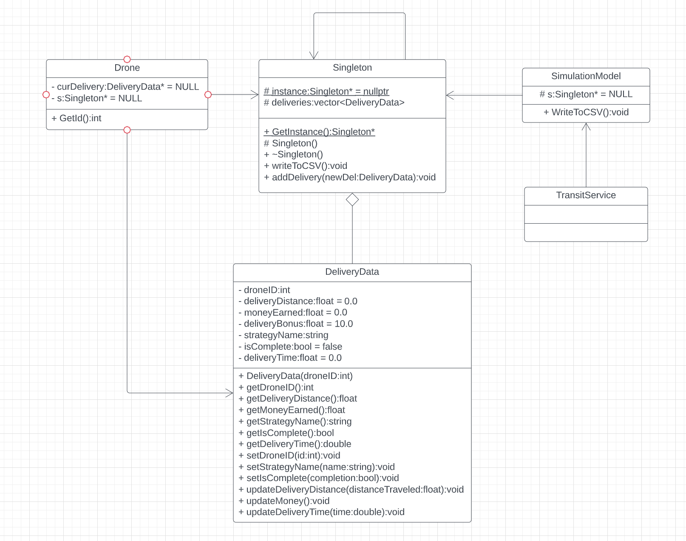
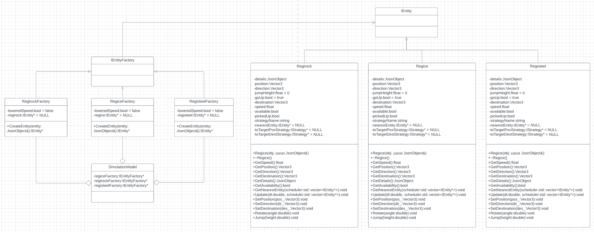

# Team-010-3-homework04
Thomas Knickerbocker, knick073  
Ethan Myos, myos0004  
Jacob Horejsi, horej024  
Tehaam Adhami, adham003  

<a href=https://hub.docker.com/repository/docker/ethanmyos/csci-3081w-homework4>Docker Link</a>  
<a href=https://youtu.be/4wzit7IqTQY>Presentation Link</a>
 
<h1>Project Brief</h1>

This project simulates drones delivering robots (placeholders for packages) on a map of the UMN campus. Drones follow roads, and their pathing is determined by the algorithm selection of the user when scheduling trips (dijktra's, dfs, astar). Drones move around the map, and even celebrate upon completing a delivery. To make the simulation more closely model the UMN campus, there are spawnable cars and even a helicopter on patrol as the simulation runs. 
As a fun addition, pokemon that can be spawned into the simulation which will affect the speed at which drones (and thus, their carried robots) move. Data is collected as the simulation runs and deliveries are completed, and can be written to an output CSV file via the "Write to CSV" button on the simulation model page. We hope you enjoy this merry interactive delivery simulation.

<h2>How to Run: </h2>

After downloading/pulling:  
$) make clean  
$) make -j  
$) ./build/bin/transit_service 8081 apps/transit_service/web/  
The simulation is now live on port 8081 of your local computer.  
To see the visualization, go to:  
http://127.0.0.1:8081   
To schedule trips and add entities, go to:  
http://127.0.0.1:8081/schedule.html  

<h2>What the code does</h2>
Spawns entities on a map with graphs and node paths representing roads. Entities may move around and drones may deliver robots. Pokemon may be spawned in, and pathfinding algorithms are used for delivieries. 
<h3>What our extensions do<h3>
<h5>Pokemon (weather) Factory</h5>

- What does it do?
   - Adds Regi Pokémon into the simulation to alter the speed of the entities.
        
- Why is it significantly interesting?
   - It serves as a sort of weather effect on the entities which will change the delivery times.
        
- How does it add to the existing work?
   - It changes the delivery times based on which Regi are in the simulation.
            
        
- Which design pattern did you choose to implement it and why?
   - Factory. This allowed us to have different Regi Pokémon spawned into the simulation, all inheriting from IEntity.
    
- Instruction to use this new feature (if the new feature is not user interactable, please mention this as well)
   - On the schedule page, the user can click buttons labeled "Add Regi..." for each type of Regi Pokémon. This will spawn the Regi into the               simulation and automatically change the speed of the entities.
   
<h5>Data Collection</h5>
- What does it do?
   - Collects data related to deliveries as the simulation runs.
        
- Why is it significantly interesting?
   - The data collected can be sliced many different ways to create interesting analysis of the simulation.
        
- How does it add to the existing work?
   - It allows users to collect data from running the sim and easily output it, allowing them to easily analyze sim data later.
            
- Which design pattern did you choose to implement it and why?
   - Singelton, because one instance of the data can be stored accross the simulation and be written to a single output file when desired.
    
- Instruction to use this new feature (if the new feature is not user interactable, please mention this as well)
   - On the simulation model page, click "Write to CSV" to write collected data from deliveries.

<h3>Sprint retrospective</h3>
What helps us be successful?   
    Meeting up, communicating in-person, and collaborating.  
What went well this sprint?  
    We got our desired extensions done on-time, and were able to learn from each other.  
What could have gone better this sprint?  
    We could have tried to meet sooner to complete things after the singleton was implemented.  
In future sprints, how can we ensure that things do go better?  
    In the future, we can attempt to meet sooner and more frequently during the early stages, and model our plan a bit better; We were somewhat unsure about how our pokemon factory extension would be implemented, at times.

<h4>Singleton UML Diagram:</h4>

<h4>Factory UML Diagram:</h4>

